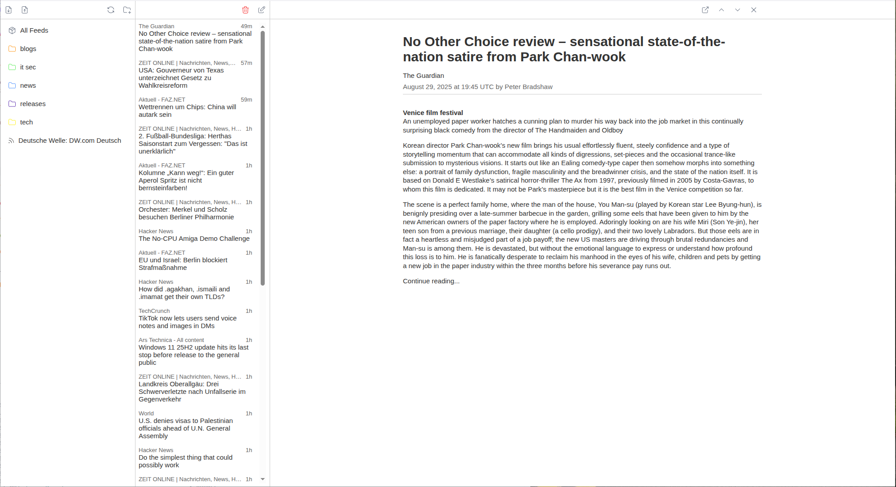

    <h1 align="center">feedBox</h1>
    

    
    <h2 align="center">Put all your feeds into a box!</h2>

# What is feedBox?

FeedBox is a simple, self-hosted feed reader build with Java. It allows you to manage all your feeds in a single place - without ads, tracking, ai or other distractions.

# Features

Currently, the application is in an non-production state. The following features are planned:

- Simple UI with automatic dark mode
- Mobile or Desktop view
- Fully self-hostable
- Import or export your feeds as OPML
- Organize your feeds in Folders
- Periodic refresh in the background

# Deployment

mvn clean install
docker build -t feedbox .
docker network create appnet
docker run -d --name postgres -p 5432:5432 -e POSTGRES_USER=user -e POSTGRES_PASSWORD=password -e POSTGRES_DB=postgres --network appnet postgres
docker run --name feedbox -p 7070:7070 --rm --network appnet feedbox

## icons

https://tablericons.com/
