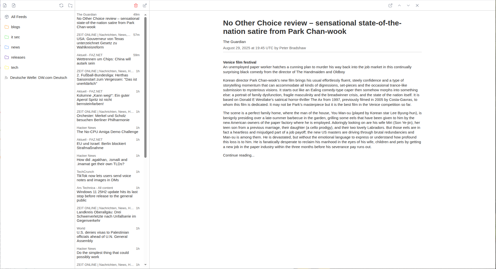

<p align="center">
  
</p>

<h1 align="center">FeedBox</h1>
<h3 align="center">Put all your feeds into a box!</h3>

<p align="center">
  <!-- Build / CI -->
  <!-- <a href="https://github.com/felixzmn/feedbox/actions">
    
  </a> -->
  <!-- Latest Release -->
  <a href="https://github.com/felixzmn/feedbox/releases">
    
  </a>
  <!-- Docker Image -->
  <a href="https://ghcr.io/felixzmn/docker/feedbox">
    
  </a>
  <!-- Helm Chart -->
  <a href="https://ghcr.io/felixzmn/helm/feedbox">
    
  </a>
  <!-- License -->
  <a href="./LICENSE">
    
  </a>
</p>



# What is FeedBox?

FeedBox is a simple, self-hosted feed reader built with Java.  
It allows you to manage all your feeds in one place—without ads, tracking, AI, or other distractions.

# Features

Feature highlights include:

- Fully self-hostable
- Automatic dark mode
- Mobile and desktop views
- Import and export feeds as OPML
- Organize feeds into folders
- Periodic background refresh

# Installation

It is possible to run FeedBox via Docker or deploy it to a Kubernetes cluster using the provided Helm chart. In both cases, a PostgreSQL database is required.
The following environment variables need to be set for database connectivity:

| Variable      | Description       |
| ------------- | ----------------- |
| `PG_USER`     | Database user     |
| `PG_PASSWORD` | Database password |
| `PG_HOST`     | Database host     |
| `PG_PORT`     | Database port     |
| `PG_DB`       | Database name     |

Additionally, the application port can be configured using the `PORT` variable (default is 7070).

## Docker

To run FeedBox using Docker, first start a PostgreSQL container, then run the FeedBox container. For testing purposes, you can use the following commands - for production, make sure to follow best practices regarding security and data persistence.

```bash
docker network create appnet

docker run -d --name postgres \
  -p 5432:5432 \
  -e POSTGRES_USER=user \
  -e POSTGRES_PASSWORD=password \
  -e POSTGRES_DB=postgres \
  --network appnet \
  postgres

docker run --rm --name feedbox \
  -p 7070:7070 \
  --network appnet \
  ghcr.io/felixzmn/docker/feedbox:latest
```

## Helm

For installing via Helm, use the following command:

```bash
helm install feedbox oci://ghcr.io/felixzmn/helm/feedbox --version <VERSION>
```

Further configuration options can be found having a look at the `values.yaml` file in the `chart` directory.

# Local Development

## Prerequisites

- PostgreSQL (e.g. via Docker)
- Java
- Maven

## Commit scopes

| Scope     | Description           |
| --------- | --------------------- |
| `backend` | Java-code             |
| `ui`      | Frontend related code |
| `chart`   | Helm chart            |
| `deps`    | Dependencies          |
| `docs`    | Documentation         |

## Build the application

```bash
mvn install -Dnative

```

Run the application:

```bash
java -jar target/*-runner.jar
```

## Build and push the Docker image:

```bash
VERSION=$(grep -m1 '<version>' pom.xml | sed -E 's/.*<version>([^<]+)<\/version>.*/\1/')

docker build -f src/main/docker/Dockerfile.native-micro -t ghcr.io/felixzmn/docker/feedbox:latest . -t ghcr.io/felixzmn/docker/feedbox:$VERSION
docker push ghcr.io/felixzmn/docker/feedbox:$VERSION
docker push ghcr.io/felixzmn/docker/feedbox:latest
```

## Build and push the Helm chart

```bash
cd chart
helm package .
helm push feedbox-*.tgz oci://ghcr.io/felixzmn/helm
```

# Release Process

Versions follow the pattern `MAJOR.MINOR.PATCH`. During development, both `pom.xml` and `chart/Chart.yaml` carry a `-SNAPSHOT` suffix. The Helm chart has two separate version fields: `version` (the chart itself) and `appVersion` (the application it ships).

## 1. Prepare the release

Remove the `-SNAPSHOT` suffix from all version fields:

- **`pom.xml`** – e.g. `1.0.3-SNAPSHOT` → `1.0.3`
- **`chart/Chart.yaml`**:
  - `appVersion` – e.g. `"1.0.3-SNAPSHOT"` → `"1.0.3"` (must match `pom.xml`)
  - `version` – e.g. `1.1.6-SNAPSHOT` → `1.1.6` (bump the patch if not already done)

## 2. Commit the release

```bash
git add pom.xml chart/Chart.yaml
git commit -m "chore: release <VERSION>"
```

## 3. Build and push the Docker image

```bash
VERSION=$(grep -m1 '<version>' pom.xml | sed -E 's/.*<version>([^<]+)<\/version>.*/\1/')

docker build -t ghcr.io/felixzmn/docker/feedbox:$VERSION -t ghcr.io/felixzmn/docker/feedbox:latest .
docker push ghcr.io/felixzmn/docker/feedbox:$VERSION
docker push ghcr.io/felixzmn/docker/feedbox:latest
```

## 4. Build and push the Helm chart

```bash
cd chart
helm package .
helm push feedbox-*.tgz oci://ghcr.io/felixzmn/helm
```

## 5. Bump versions back to the next snapshot

After the release artifacts are published, advance to the next development version:

- **`pom.xml`** – increment the patch version and add `-SNAPSHOT`, e.g. `1.0.3` → `1.0.4-SNAPSHOT`
- **`chart/Chart.yaml`**:
  - `appVersion` – match the new `pom.xml` version, e.g. `"1.0.4-SNAPSHOT"`
  - `version` – increment the patch version and add `-SNAPSHOT`, e.g. `1.1.6` → `1.1.7-SNAPSHOT`

Commit the result:

```bash
git add pom.xml chart/Chart.yaml
git commit -m "chore: bump version to <NEXT_VERSION>-SNAPSHOT"
```

# Icons

[Icons from Tabler Icons.](https://tablericons.com/)\
[PWA Icon generated with maskable](https://maskable.app/editor)
